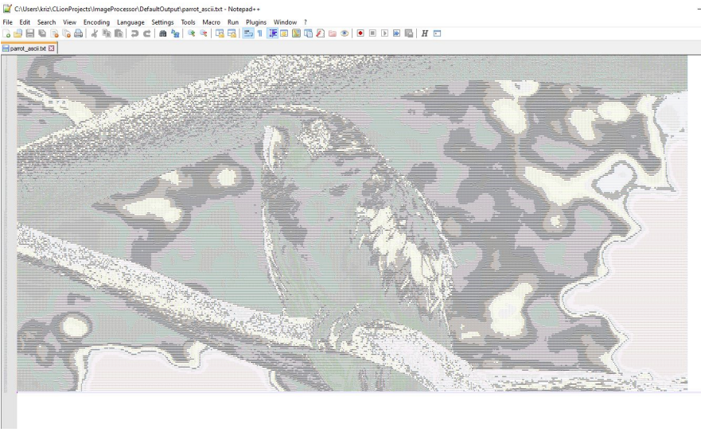

# Image Processor


Simple image processing software with a CLI interface for Linux.

The application allows loading images, managing them in an internal image
library and applying several image processing filters such as grayscale
conversion, blur effects, edge detection or ASCII art generation.

---

## Features

Supported filters:

- Linear grayscale
- Averaged grayscale
- Negative
- Box blur
- Gaussian blur
- Sobel edge detection
- Flip transformation (horizontal / vertical)
- ASCII art conversion

Some filters allow additional parameters (for example kernel size or sigma
for Gaussian blur).

---

## Example filters

Example outputs of several filters applied to the same image.


---

## ASCII Art example

The application can also convert images into ASCII art.



---

## Supported images

Currently supported formats:

- `.jpg`
- `.jpeg`

Limitations:

- only **sRGB color space** is supported
- image dimensions must be greater than **1×1 pixels**

---

## Build

The project uses **CMake**.

```bash
git clone <repository_url>
cd ImageProcessor
mkdir build
cd build
cmake ..
make
```

Executable will be created in the `build` directory.

---

## Configuration

It is possible to provide startup configuration using `config.yaml`
in the executable directory.

Example:

```yaml
default_input_directory: /path/to/input/images
default_output_directory: /path/to/output/images
```

Settings:

- `default_input_directory` – directory from which images are loaded at startup
- `default_output_directory` – fallback directory used when saving images

---

## Project structure

Main components of the project:

- `ImageEffects` – implementations of image filters
- `ImageLibrary` – image loading and representation
- `Services` – configuration loading and utilities
- `UserMenu` – CLI user interface

---

## Documentation

More detailed documentation (Czech):

📄 [Documentation](docs/dokumentace_image_processor.pdf)

---

## License

All rights reserved.

This project is publicly visible for educational purposes only.  
Use of this code requires explicit permission from the author.

---

## Author

Ondřej Kříž
